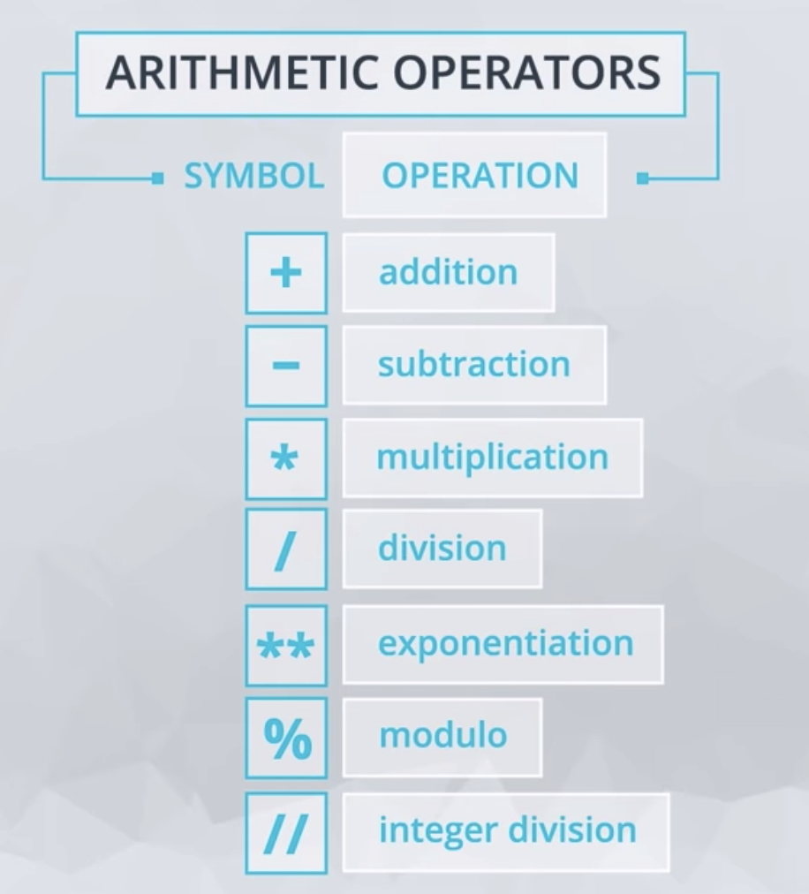
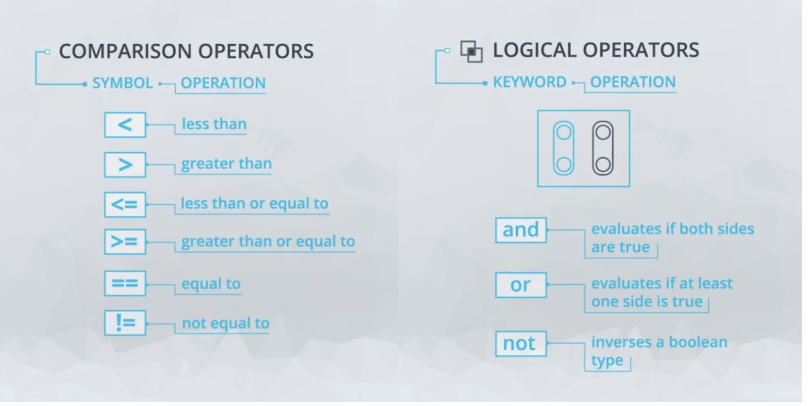
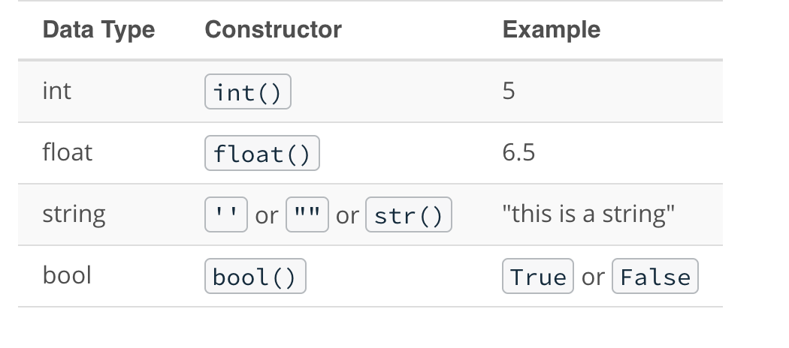
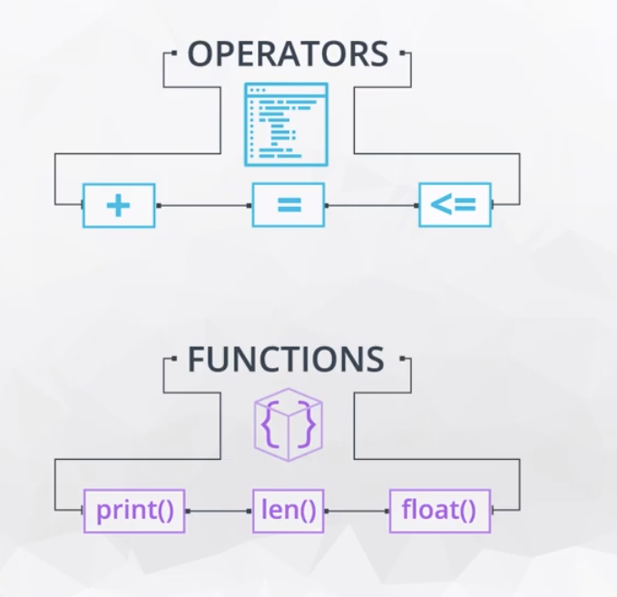

# Python_DataAnalysis
 
 This project provides detailed information and guidance on Exploratory Data Analysis and Visualisations for Data Science projects from fundamental to Advanced using Python. First I explored the different arithmetic operators, syntax and data types in python and demonstrates how to:

 - load/read data 
 - using Numpy array and Pandas
 - visualise data using Matplotlib and Seaborn
 - clean data and compute for missing data

# Exploratory Data Analysis for Machine Learning 

| Details            |              |
|-----------------------|---------------|
| Programming Language: |  Python 3.7 or 3.8 |


## Setting-up Developement Environment and installing dependencies 

- Install `Anaconda` on your system: https://docs.anaconda.com/anaconda/install/

- setup a virtual environment using the command line: `conda create --name <env_name> python3.7`. More info [here](https://docs.conda.io/projects/conda/en/latest/user-guide/tasks/manage-environments.html?highlight=environment#creating-an-environment-from-an-environment-yml-file)

- Activate the virtual environment using command line: `conda activate <env_name>`

- using `pip install` or `conda install`, install the following libraries and dependencies:

* open terminal:
   ```
   pip install numpy
   pip install pandas
   pip install matplotlib
   ```
- when the setup is complete, open `jupyter notebook` from the terminal

## Different Arithmetic Operators and Data Types 

- Arithmetic Operators:



- Comparison and Logic Operators:



- Data Type and Functions:







# Data Visualisation


[  [](https://gitter.im/fairlearn/community?utm_source=badge&utm_medium=badge&utm_campaign=pr-badge) 
